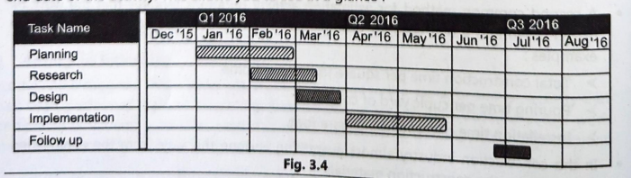
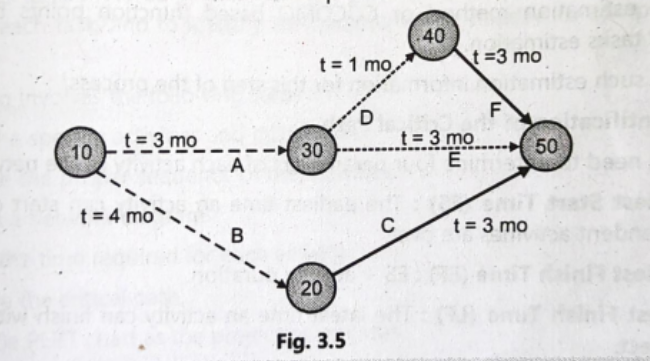
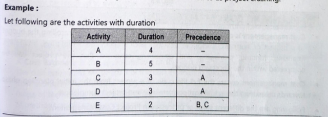
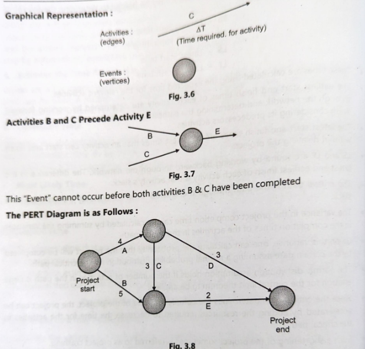
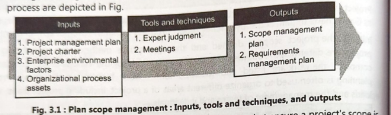
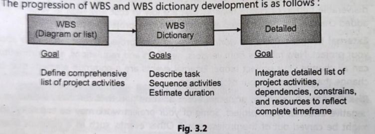

# Project Scheduling

### Summary Table: Importance of Project Scheduling

| Point                             | Explanation                                                             |
| ------------------------------------- | --------------------------------------------------------------------------- |
| 1. Coordination of Activities     | Helps manage and organize multiple parallel tasks in complex projects.      |
| 2. Identifies Dependencies        | Shows task relationships to ensure correct task execution order.            |
| 3. Tracks Progress                | Provides a baseline to measure actual progress and detect delays.           |
| 4. Efficient Resource Utilization | Ensures optimal use of people, tools, and materials.                        |
| 5. Risk Identification            | Highlights critical tasks where delays may occur.                           |
| 6. Better Decision-Making         | Helps managers reallocate resources or adjust timelines.                    |
| 7. Cost Estimation Support        | Time and effort estimates help predict project cost.                        |
| 8. Improves Communication         | Clearly communicates plan, deadlines, and responsibilities to stakeholders. |

---

### Summary Table: Steps Involved in Developing a Project Schedule

| Step                           | Description                                                                          |
| ---------------------------------- | ---------------------------------------------------------------------------------------- |
| 1. Define Activities           | Break the project into small, manageable tasks (activity list).                          |
| 2. Determine Activity Sequence | Identify dependencies and order of activities (network diagram).                         |
| 3. Estimate Activity Resources | Decide required resources: people, tools, materials, equipment.                          |
| 4. Estimate Activity Durations | Determine how long each task will take using estimation techniques.                      |
| 5. Develop the Schedule        | Combine sequence, resources, and durations to create a full schedule (CPM, Gantt chart). |
| 6. Review & Optimize           | Apply resource leveling and schedule compression to ensure feasibility.                  |
| 7. Finalize & Communicate      | Approve the schedule, set the baseline, and share it with the team and stakeholders.     |

---

# Gantt Chart

### Summary Table: Use of Gantt Charts in Project Scheduling

| Aspect                       | Explanation                                                                  |
| -------------------------------- | -------------------------------------------------------------------------------- |
| Visual Timeline              | Shows project tasks as bars along a time scale (start date, duration, end date). |
| Task Sequencing              | Displays order of activities, dependencies, and overlapping tasks.               |
| Responsibility Assignment    | Identifies who is working on each task.                                          |
| Duration & Effort Estimation | Helps determine how long each task will take and the required effort.            |
| Critical Path Identification | Highlights tasks that must be completed on time to avoid project delay.          |
| Complete Project Overview    | Shows start & finish dates, task progress, and project flow in one place.        |

---

### Summary Table: Importance of Milestones in Gantt Charts

| Milestone Type              | Purpose / Importance                                            |
| ------------------------------- | ------------------------------------------------------------------- |
| Key Dates                   | Marks important events (launches, meetings, reviews).               |
| Key Deadlines               | Highlights critical deadlines for completion of major tasks/phases. |
| External Dates & Deliveries | Tracks vendor deliveries, hiring dates, or external commitments.    |
| Zero Duration Indicators    | Used to show checkpoints without consuming project time.            |
| Progress Markers            | Represents the end of a major phase or approval point.              |

---

### Summary Table: Use of Tracking Gantt Charts for Monitoring Progress

| Feature                      | How It Helps                                                    |
| -------------------------------- | ------------------------------------------------------------------- |
| Planned vs Actual Comparison | Shows deviations between scheduled and actual timelines.            |
| Percent Complete Tracking    | Displays how much work is finished versus remaining.                |
| Effort Comparison            | Compares planned effort vs actual effort spent.                     |
| Early Delay Identification   | Highlights late tasks or phases so corrective actions can be taken. |
| Multi-Project Planning       | Useful for viewing tasks across multiple projects or sprints.       |
| Team Collaboration           | Helps teams coordinate delays, dependencies, and workload.          |

---

---

# Critical Path Method (CPM)

### Table 1: CPM Concepts & Example Summary

| Category                     | Details                                                                                             |
| -------------------------------- | ------------------------------------------------------------------------------------------------------- |
| Definition of CPM            | Technique to identify the longest sequence of dependent activities and minimum project completion time. |
| Critical Path Meaning        | Activities with zero float; delay in any of them delays the whole project.                          |
| Activity Durations (Example) | A=3, B=4, C=3, D=1, E=3, F=3 months                                                                     |
| Possible Paths               | • B → C = 7 months • A → D → F = 7 months • A → E = 6 months                          |
| Critical Paths               | • Path 1: B → C • Path 2: A → D → F                                                          |
| Float (Slack)                | Activity E has 1 month float (6 vs 7 months).                                                   |
| Minimum Project Duration     | 7 months                                                                                            |

---

### Table 2: Steps of CPM & Importance

#### A. Steps in the Critical Path Method

| Step No.                           | Description                                        |
| -------------------------------------- | ------------------------------------------------------ |
| 1. Activity Specification          | Identify activities using WBS.                         |
| 2. Activity Sequence Establishment | Determine predecessor–successor relationships.         |
| 3. Network Diagram Construction    | Draw logical flow (PERT/CPM chart).                    |
| 4. Estimate Durations              | Use expert judgment, 3-point estimation, etc.          |
| 5. Identify Critical Path          | Calculate ES, EF, LS, LF → find zero-float activities. |
| 6. Update Diagram                  | Track actual progress and revise schedule.             |

#### B. Importance of CPM

| Benefit                    | Explanation                                        |
| ------------------------------ | ------------------------------------------------------ |
| Minimum completion time        | Defines shortest possible project duration.            |
| Highlights critical activities | Focuses attention on tasks that cannot slip.           |
| Improves scheduling            | Shows clear sequence and dependencies.                 |
| Efficient resource allocation  | Resources can be assigned to critical tasks.           |
| Better tracking & monitoring   | Detects delays early.                                  |
| Enables acceleration           | Supports fast-tracking or crashing decisions.          |
| Better decision-making         | Provides realistic planning and risk visibility.       |
| Visual overview                | Network diagrams make project flow easy to understand. |

---

---

# PERT

### Summary Table: PERT (Program Evaluation and Review Technique)

| Aspect                  | Summary                                                                                                                             |
| --------------------------- | --------------------------------------------------------------------------------------------------------------------------------------- |
| Definition              | A project management tool used to schedule, organize, and analyze project activities, especially when activity durations are uncertain. |
| Purpose                 | To estimate project duration, identify dependencies, and determine the minimum time to complete the project.                            |
| Focus                   | Uses three-time estimates (O, M, P) to calculate expected activity duration.                                                            |
| Formula (Expected Time) | ( TE = \frac{O + 4M + P}{6} )                                                                                                           |
| Variance Formula        | ( Variance = \left( \frac{P - O}{6} \right)^2 )                                                                                         |
| Output                  | Network diagram showing activity flow and the critical path.                                                                            |

---

### Summary Table: Steps in Constructing a PERT Chart

| Step                                | Description                                                                          |
| --------------------------------------- | ---------------------------------------------------------------------------------------- |
| 1. Identify Activities & Milestones | List all tasks and major events required to complete the project.                        |
| 2. Determine Activity Sequence      | Identify dependencies and logical order of tasks.                                        |
| 3. Construct Network Diagram        | Draw nodes (events) and arrows (activities) showing task flow.                           |
| 4. Estimate Activity Time           | Use Optimistic, Most Likely, and Pessimistic time to compute expected time and variance. |
| 5. Determine Critical Path          | Calculate path durations; the longest path determines project duration.                  |
| 6. Update PERT Chart                | Modify the chart continuously as the project progresses with actual completion times.    |

---

### Comparison Table: CPM vs PERT

| Basis                   | CPM (Critical Path Method)                                                          | PERT (Program Evaluation and Review Technique)                                       |
| --------------------------- | --------------------------------------------------------------------------------------- | ---------------------------------------------------------------------------------------- |
| Nature / Focus          | Deterministic technique (time is known and fixed).                                      | Probabilistic technique (time is uncertain).                                             |
| Type of Projects        | Suitable for projects with repetitive, predictable tasks (construction, manufacturing). | Suitable for research, development, and new projects where time estimation is uncertain. |
| Time Estimates Used     | Single time estimate for each activity.                                                 | Three time estimates (Optimistic O, Most Likely M, Pessimistic P).                       |
| Duration Calculation    | Duration is fixed based on past experience.                                             | Expected time calculated using formula: ( TE = \frac{O + 4M + P}{6} ).                   |
| Focus on                | Time–cost trade-off, resource optimization.                                             | Time estimation under uncertainty, identifying expected project duration.                |
| Use of Activity Cost    | Cost is considered; CPM deals with cost control and crashing.                           | Cost is not the main focus; only time is analyzed.                                       |
| Application             | Construction projects, maintenance, infrastructure, road building.                      | R&D projects, software development, space missions, design projects.                     |
| Critical Path Meaning   | Based on precise duration; delays directly delay the project.                           | Based on expected duration; critical path identified through probabilistic times.        |
| Float/Slack Calculation | Calculated using ES, EF, LS, LF.                                                        | Slack can also be calculated, but logic is probability-based.                            |
| Model Type              | Activity-on-node or activity-on-arrow deterministic model.                              | Activity-on-arrow probabilistic model.                                                   |
| Best Suited For         | Projects with predictable activities.                                                   | Projects with uncertain or new activities.                                               |

---

### Example for CPM

#### Project Activities:

* A → 3 months
* B → 4 months
* C → 3 months
* D → 1 month
* E → 3 months
* F → 3 months

#### From your textbook diagram (CPM)

Critical paths were:

1. B → C = 7 months
2. A → D → F = 7 months

→ Project minimum duration = 7 months
→ Activity E had float = 1 month.

This is a typical CPM example because durations are fixed and known.

---

### Example for PERT

#### Activity Time Estimates (Example)

Suppose Activity A has the following PERT estimates:

* Optimistic (O) = 4 weeks
* Most Likely (M) = 6 weeks
* Pessimistic (P) = 10 weeks

#### Expected Time:

[
TE = \frac{O + 4M + P}{6}
= \frac{4 + 4(6) + 10}{6}
= \frac{4 + 24 + 10}{6}
= 6.33\text{ weeks}
]

Variance:
[
Variance = \left(\frac{P - O}{6}\right)^2
= \left(\frac{10 - 4}{6}\right)^2
= 1
]

Using these TE values for all activities, a PERT network diagram is constructed (like in your textbook’s Fig. 3.8), and the critical path is computed based on expected values.

This is a PERT example because time is uncertain and probabilistic.

---

#### Short, Exam-Ready Conclusion

* CPM is used for well-defined projects with predictable activity durations, uses single-time estimates, and emphasizes time-cost optimization.
* PERT is used for uncertain projects with three-time estimates and focuses on expected project duration and risk management.

---

---

# Cost Estimation And COCOMO

###  Summary Table: Cost Estimation Tools & Techniques

| Technique                          | Description                                                             | Advantages                                        | Limitations                                                |
| -------------------------------------- | --------------------------------------------------------------------------- | ----------------------------------------------------- | -------------------------------------------------------------- |
| Analogous Estimating (Top-Down)    | Uses cost of similar past projects to estimate current project.             | Fast, low cost, simple.                               | Least accurate; depends on expert judgment.                    |
| Parametric Estimating              | Uses statistical/mathematical models + historical data to estimate cost.    | More accurate than analogous; considers cost drivers. | Requires reliable data; may not work well for unique projects. |
| Three-Point Estimating (PERT Cost) | Uses Optimistic, Most-Likely, Pessimistic costs to calculate expected cost. | Reduces uncertainty and bias; handles risks better.   | More complex; requires 3 estimates for each activity.          |
| Bottom-Up Estimating (Definitive)  | Estimates cost of each detailed task and sums them up.                      | Most accurate; high detail.                           | Very time-consuming and expensive.                             |

---

###  Summary Table: Types of Software Projects (COCOMO)

| Project Type  | Characteristics                                                     | Examples                                               |
| ----------------- | ----------------------------------------------------------------------- | ---------------------------------------------------------- |
| Organic       | Small, simple projects; stable requirements; experienced small team.    | Payroll system, inventory software.                        |
| Semi-Detached | Medium complexity; mixed experience team; partially known requirements. | Business applications, compilers, utilities.               |
| Embedded      | Large, complex systems with hardware/software constraints; real-time.   | Radar systems, flight control, medical equipment software. |

---

###  Summary Table: COCOMO Effort Estimation Constants

| Project Type  | a | b | Effort Formula         |
| ----------------- | ----- | ----- | -------------------------- |
| Organic       | 2.4   | 1.05  | Effort = 2.4 × (KLOC)^1.05 |
| Semi-Detached | 3.0   | 1.12  | Effort = 3.0 × (KLOC)^1.12 |
| Embedded      | 3.6   | 1.20  | Effort = 3.6 × (KLOC)^1.20 |

---

###  Summary Table: How COCOMO Helps Estimate Effort

| Project Type  | How COCOMO Helps                                                                           |
| ----------------- | ---------------------------------------------------------------------------------------------- |
| Organic       | Provides quick estimates for small, straightforward software projects.                         |
| Semi-Detached | Adjusts effort for moderate complexity and mixed team experience.                              |
| Embedded      | Handles strict real-time constraints and safety-critical systems with higher effort estimates. |

---

# Project Initiation Planning Scoe Management

###  Summary Table: Project Initiation

| Topic                    | Summary                                                                                               |
| ---------------------------- | --------------------------------------------------------------------------------------------------------- |
| Definition               | First phase of project management; involves starting a new project and securing approval.                 |
| Purpose                  | Define problem/opportunity, analyze solutions, justify project, outline scope & objectives, get approval. |
| Key Output               | Business Case (detailed justification for the project).                                               |
| Business Case Includes   | Problem/opportunity description, business objectives, assumptions, constraints.                           |
|                              | Alternative solutions.                                                                                    |
|                              | Cost–benefit, risk, and issue analysis.                                                                   |
|                              | Preferred solution explanation.                                                                           |
|                              | Major project requirements.                                                                               |
|                              | Implementation plan (schedule + financial analysis).                                                      |
| Next Step After Approval | Create Project Charter (PID), authorize project, define stakeholders & high-level scope.              |

---

###  Summary Table: Planning Scope Management

| Element                   | Summary                                                                                                |
| ----------------------------- | ---------------------------------------------------------------------------------------------------------- |
| Definition                | Process of defining how project scope will be planned, managed, validated, and controlled.                 |
| Objective                 | Control what is and is not included in the project’s scope.                                        |
| Inputs                    | Project management plan, project charter, enterprise environmental factors, organizational process assets. |
| Tools & Techniques        | Expert judgment, meetings.                                                                                 |
| Outputs                   | Scope management plan, requirements management plan.                                                       |
| Scope Management Contains | Scope planning, execution, control.                                                                        |
| Scope Plan Answers        | How scope is achieved, tools used, EEF/OPA needed, how scope changes are managed.                          |

---

###  Summary Table: Reasons for Scope Change

| Reason                 | Description                                              |
| -------------------------- | ------------------------------------------------------------ |
| 1. Errors & Omissions  | Missing or incorrect requirements must be corrected.         |
| 2. Value-Added Changes | Improvements that increase value or quality at low cost.     |
| 3. External Events     | New regulations, vendor updates, competitor actions.         |
| 4. Risk Events         | Positive or negative risks requiring scope addition/removal. |

---

###  Summary Table: Scope Management

| Aspect                   | Summary                                                                                    |
| ---------------------------- | ---------------------------------------------------------------------------------------------- |
| Definition               | Ensures the project includes all required work and excludes unnecessary work.                  |
| Purpose                  | Define, validate, and control the project scope to prevent scope creep.                        |
| Key Processes            | Scope Planning, Scope Execution, Scope Control.                                                |
| Main Questions Answered  | How scope will be achieved, tools required, EEF/OPA needed, how scope changes will be managed. |
| Reasons for Scope Change | Errors & Omissions, Value-added changes, External events, Risk events.                         |

---

---

# Work Breakdown Structure (WBS)

###  Summary Table: Steps in Creating a Work Breakdown Structure (WBS)

| Step                                   | Explanation                                                                             |
| ------------------------------------------ | ------------------------------------------------------------------------------------------- |
| 1. Identify Project Work (Level 1)     | Define the overall project title or major deliverable.                                      |
| 2. Define Major Deliverables (Level 2) | Break project into major phases/sections (e.g., Requirements, Design).                      |
| 3. Decompose Deliverables (Level 3)    | Break Level 2 items into smaller sub-deliverables/work components.                          |
| 4. Create Work Packages                | Smallest manageable tasks where cost/time can be estimated accurately.                      |
| 5. Prepare WBS Dictionary              | Document details of each work package: description, dependencies, duration, responsibility. |
| 6. Refine & Update WBS                 | Progressive elaboration as more project info becomes available.                             |

---

###  Summary Table: Key Characteristics of a WBS

| Characteristic               | Meaning                                                              |
| -------------------------------- | ------------------------------------------------------------------------ |
| Hierarchical Levels          | Typically includes project level, summary level, and work package level. |
| Numbering Sequence           | Uses outline numbering (1.0, 1.1, 1.1.1 etc.) for clarity.               |
| Lowest-Level Descriptions    | Described using verbs + nouns (e.g., “Create login page”).               |
| Supported by WBS Dictionary  | Ensures clarity and defines each WBS element.                            |
| Basis for Schedule & Costing | Used to estimate time, cost, and resources accurately.                   |

---

