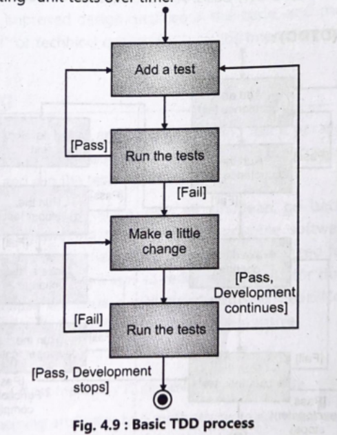
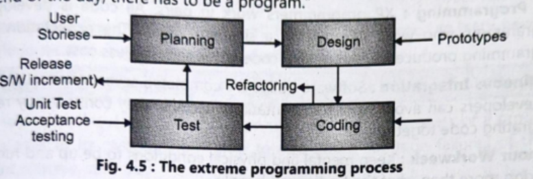
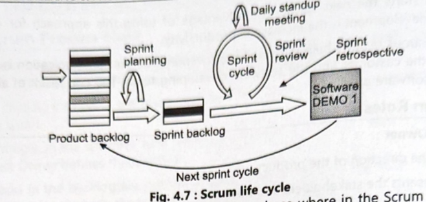

# Agile Development

#### Summary of Agile Practices

| Agile Practice                | Key Steps / Characteristics                                                              | Benefits                                                          |
| --------------------------------- | -------------------------------------------------------------------------------------------- | --------------------------------------------------------------------- |
| Test-Driven Development (TDD) | 1. Write a failing test 2. Write minimal code 3. Run tests 4. Refactor 5. Repeat | Ensures quality, reduces defects, improves design and maintainability |
| Acceptance TDD (ATDD)         | Write acceptance tests first; implement only enough code to pass                             | Improves requirement clarity; ensures customer-focused development    |
| Developer TDD (DTDD)          | Write unit tests; write code; refactor                                                       | Produces clean and testable code                                      |
| Refactoring                   | Make small changes; run tests; remove old code; improve structure                            | Better readability, reusable design, reduces technical debt           |
| Pair Programming              | Two developers share a workstation; driver–navigator model                                   | Continuous review, knowledge sharing, reduces errors                  |
| Continuous Integration (CI)   | Frequently integrate code; automated builds/tests; never leave broken builds                 | Faster feedback, fewer integration issues, stable codebase            |
| Exploratory Testing           | Testers design tests on the fly; creative and flexible testing                               | Finds unexpected defects, complements scripted tests                  |

---

#### Agile vs Waterfall (Flexibility, Delivery, Team Collaboration)

| Aspect               | Agile Development                                              | Traditional Waterfall                                   |
| ------------------------ | ------------------------------------------------------------------ | ----------------------------------------------------------- |
| Flexibility          | Highly flexible; changes accepted anytime; iterative               | Rigid; changes expensive and difficult; sequential          |
| Delivery             | Incremental and continuous delivery every iteration                | Final product delivered only at end                         |
| Customer Involvement | High; continuous feedback throughout lifecycle                     | Low; involvement mainly at start and end                    |
| Team Collaboration   | Daily communication, cross-functional teams, collaboration-focused | Siloed teams; communication through formal documents        |
| Risk Handling        | Early detection; working software reduces uncertainty              | High risk due to late testing and delayed feedback          |
| Testing              | Continuous; testing integrated with development (TDD, CI)          | Testing happens after development; late detection of issues |
| Response to Change   | Quick; iterations accommodate new requirements                     | Slow; changes require redesign and re-documentation         |

---

#### Comparison: Scripted Testing vs Exploratory Testing

| Factor           | Scripted Testing                                                                                                                                        | Exploratory Testing                                                                                                                                     |
| -------------------- | ----------------------------------------------------------------------------------------------------------------------------------------------------------- | ----------------------------------------------------------------------------------------------------------------------------------------------------------- |
| Definition       | Testing that follows predefined and documented test cases, steps, and expected results.                                                                     | Testing where the tester designs, executes, and evaluates tests simultaneously without predefined scripts.                                              |
| Approach         | Structured, formal, and planned in advance.                                                                                                                 | Informal, creative, flexible, and adaptive.                                                                                                                 |
| Test Design      | Tests are designed beforehand by testers or test managers; no deviation allowed.                                                                            | Tests are designed on the spot based on tester’s intuition, knowledge, and findings during testing.                                                         |
| Tester Role      | Tester follows instructions strictly like a script, similar to a checklist.                                                                                 | Tester has autonomy to explore the system and decide what to test next.                                                                                     |
| Creativity Level | Low creativity; mainly procedural.                                                                                                                          | Very high creativity; encourages investigation and discovery.                                                                                               |
| Documentation    | Heavy documentation — test cases, steps, expected outputs are clearly written.                                                                              | Minimal documentation; focus is on learning, exploring, and discovering defects.                                                                            |
| Flexibility      | Rigid — cannot change the flow of testing.                                                                                                                  | Very flexible — tester changes direction based on observations.                                                                                             |
| Best For         | Repetitive tests, regression testing, compliance, predictable test scenarios.                                                                               | New feature testing, unclear requirements, usability testing, discovering unexpected defects.                                                               |
| Limitations      | • Might miss real-world issues because testers only check what is written. • Limits learning and discovery. • Does not encourage exploring new paths. | • May miss simple issues because tests are not structured. • Depends heavily on tester’s skill and experience. • Harder to reproduce issues at times. |
| Example          | “Click Login → Enter User → Enter Password → Expected Result = Success.”                                                                                    | Tester tries logging in with invalid data, empty fields, long strings, switching pages, etc. without predefined steps.                                      |

Here is the clean, concise summary table for Test-Driven Development (TDD) based on your earlier images.

---

#### Summary Table: Test-Driven Development (TDD)

| Aspect          | Description                                                                                                                                                                                                                                                                                                                                                                                                 |
| ------------------- | --------------------------------------------------------------------------------------------------------------------------------------------------------------------------------------------------------------------------------------------------------------------------------------------------------------------------------------------------------------------------------------------------------------- |
| Definition      | TDD is an evolutionary development approach where tests are written before writing production code. Development proceeds in very short, repeatable cycles.                                                                                                                                                                                                                                                  |
| Purpose         | Ensures correctness, improves design quality, reduces defects, and maintains clean, refactored code.                                                                                                                                                                                                                                                                                                            |
| TDD Cycle Steps | 1. Add a Test: Write a small unit test for a new feature. 2. Run the Test: It should fail (feature not implemented yet). 3. Write Minimal Code: Add just enough code to make the test pass. 4. Run All Tests: Ensure new and existing tests pass. 5. Refactor: Improve code structure without changing behavior. 6. Repeat: Continue adding new tests and refining code. |
| Levels of TDD   | Acceptance TDD (ATDD): Write acceptance tests based on behavioral requirements. Developer TDD (DTDD): Write developer-level unit tests; refine design.                                                                                                                                                                                                                                               |
| Advantages      | Reduces defect rates, improves code quality, enhances clarity and cohesion, encourages refactoring, and ensures maintainability.                                                                                                                                                                                                                                                                                |
| Example         | Test: `assert add(2, 3) == 5` → fails. Code: `def add(a,b): return a+b` → test passes. Refactor: Clean code if needed.                                                                                                                                                                                                                                                                        |

---

---

# XP Programming

### 1. XP Process Steps (Basic XP Activities)

| XP Process Step      | Summary                                                                                                                               |
| ------------------------ | ----------------------------------------------------------------------------------------------------------------------------------------- |
| Designing            | Create a simple design focused on current requirements; avoids unnecessary complexity; keeps system modular and ready for refactoring.  |
| Coding               | Central activity; coding starts early; follows coding standards; collective code ownership ensures everyone contributes.                  |
| Testing              | Testing is done before coding (TDD); includes unit tests & acceptance tests; every increment must pass all tests.                       |
| Planning / Listening | Customer provides user stories; team estimates, prioritizes, and plans small releases; ongoing communication ensures requirement clarity. |

---

### 2. XP Core Practices

| XP Practice            | Summary                                                              |
| -------------------------- | ------------------------------------------------------------------------ |
| User Stories           | Short customer-written feature descriptions that guide planning.         |
| Small Releases         | Frequent, simple increments delivering business value.                   |
| Metaphor               | Common naming/architecture concept to ensure team understanding.         |
| Simple Design          | Implement only what is needed now; avoid extra features.                 |
| Refactoring            | Continuous improvement of code structure without changing functionality. |
| Testing                | Unit + acceptance tests; code written to pass tests (TDD).               |
| Pair Programming       | Two programmers work together on one machine for better quality.         |
| Continuous Integration | Code integrated multiple times daily to avoid merge issues.              |
| Collective Ownership   | Any developer can work on any part of the code.                          |
| Coding Standards       | Uniform coding style across the team.                                    |
| Sustainable Pace       | 40-hour work week; avoids burnout and maintains productivity.            |
| On-site Customer       | Customer representative available full-time for clarifications.          |

---

### 3. XP Values

| XP Value      | Summary                                                                         |
| ----------------- | ----------------------------------------------------------------------------------- |
| Communication | Encourages constant interaction among team and customer to avoid misunderstandings. |
| Simplicity    | Focus on the simplest solution that works.                                          |
| Feedback      | Continuous customer and test feedback to adjust development.                        |
| Courage       | Confidence to refactor, simplify, and adapt to change.                              |
| Respect       | Mutual respect among team members; improves collaboration.                          |

---

### 4. XP Diagram Explanation (From Images)

| Diagram Stage  | Explanation                                                         |
| ------------------ | ----------------------------------------------------------------------- |
| Planning       | Customer gives user stories; team estimates and prioritizes features.   |
| Design         | Simple, prototype-based design focusing only on required functionality. |
| Coding         | Code is written following standards and pair programming.               |
| Testing        | Unit tests and acceptance tests executed; ensures correctness.          |
| Refactoring    | Code continuously improved for readability and quality.                 |
| Small Releases | Working increments frequently delivered to customer for feedback.       |
| Cycle/Loop     | These steps repeat continuously, enabling rapid, iterative development. |

---

---

# Scrum & Sprint

### Summary Table: Scrum Events & Their Role in Efficient Sprint Execution

| Scrum Event                  | Purpose                                                                              | Role in Efficient Sprint Execution                                                                                                                                               |
| -------------------------------- | ---------------------------------------------------------------------------------------- | ------------------------------------------------------------------------------------------------------------------------------------------------------------------------------------ |
| Sprint Planning              | Defines what will be done and how. Creates Sprint Goal and Sprint Backlog.           | ✓ Gives clear direction for the sprint ✓ Helps team commit to realistic workload ✓ Breaks user stories into actionable tasks ✓ Ensures everyone starts aligned and prepared |
| Daily Stand-up (Daily Scrum) | 15-minute daily meeting to inspect and adapt. Each member answers 3 questions.           | ✓ Tracks daily progress ✓ Quickly identifies blockers and issues ✓ Keeps team synchronized and coordinated ✓ Enables fast adjustments to stay on track                      |
| Sprint Review                | Demonstration of the working product increment to stakeholders at the end of the sprint. | ✓ Ensures transparency & validation of work ✓ Collects customer feedback early ✓ Helps adjust backlog for next sprints ✓ Prevents building wrong or unwanted features       |
| Sprint Retrospective         | Team meeting to analyze how the sprint went and find improvement areas.                | ✓ Improves team processes and communication ✓ Identifies what went well & what didn’t ✓ Creates action items for next sprint ✓ Drives continuous improvement and efficiency |

---

### Summary Table: Scrum & Its Roles

| Topic                         | Summary                                                                                                                                                                                                                                                                                                           |
| --------------------------------- | --------------------------------------------------------------------------------------------------------------------------------------------------------------------------------------------------------------------------------------------------------------------------------------------------------------------- |
| Scrum (Definition)            | Scrum is an agile framework that divides development into short, time-boxed cycles called sprints. It addresses issues like changing requirements, unrealistic estimates, and poor communication. Scrum emphasizes incremental delivery, continuous improvement, quality, and team potential. |
| Product Owner                 | • Sets direction of the product • Represents stakeholders & business • Ensures right features enter the product backlog • Creates and prioritizes product backlog items • Clarifies requirements to the team • Responsible for maximizing product value                            |
| Scrum Master                  | • Ensures Scrum runs smoothly • Sets up meetings and facilitates discussions • Monitors project progress and removes impediments • Protects team from external interferences • Helps team follow Scrum rules & practices • Acts as a servant-leader                            |
| Development Team (Scrum Team) | • Cross-functional group (8–10 people) • Performs analysis, design, coding, testing, writing etc. • Estimates tasks and commits to sprint work • Self-organized & empowered to make decisions • Delivers potentially shippable product increment each sprint                                  |

---

### Summary Table: Daily Scrum Meeting

| Aspect                       | Summary                                                                                                                                                                                                                        |
| -------------------------------- | ---------------------------------------------------------------------------------------------------------------------------------------------------------------------------------------------------------------------------------- |
| Purpose of Daily Scrum       | • Inspect daily progress toward Sprint Goal • Synchronize team activities • Identify & escalate impediments • Enable quick planning for next 24 hours • Keep team focused and aligned                                  |
| Structure of the Meeting     | 15-minute time-boxed stand-up where each member answers: 1. What did I do yesterday? 2. What will I do today? 3. Are there any impediments?                                                                               |
| Key Elements Discussed       | • Yesterday’s completed work • Today’s planned work • Blockers/impediments • Sprint Backlog progress • Task coordination • Alignment with Sprint Goal                                                               |
| Participants                 | • Development Team (main participants) • Scrum Master (facilitator, removes impediments) • Product Owner (optional observer)                                                                                     |
| Contribution to Team Success | • Early detection of issues • Improves transparency • Enhances team coordination • Helps maintain focus on sprint goal • Enables quick adjustments • Encourages accountability • Supports continuous improvement |

---

---

# Agile Manifesto

### Summary Table: Agile Manifesto – Four Key Values with Examples

| Agile Value                                              | Meaning                                                                                                                         | Example                                                                                                                   |
| ------------------------------------------------------------ | ----------------------------------------------------------------------------------------------------------------------------------- | ----------------------------------------------------------------------------------------------------------------------------- |
| 1. Individuals and Interactions over Processes and Tools | People, communication, teamwork, motivation, and collaboration are more important than strict tools or rigid processes.             | Developers discuss issues directly, pair programming, daily stand-up meetings instead of relying only on emails or documents. |
| 2. Working Software over Comprehensive Documentation     | Delivering functional software is valued more than creating lengthy documentation. Documentation is still important, but secondary. | Instead of spending months writing requirement documents, the team delivers a working prototype every 2 weeks for feedback.   |
| 3. Customer Collaboration over Contract Negotiation      | Continuous customer involvement is preferred rather than only agreeing on requirements at the start.                                | Customer reviews each sprint and gives new requirements instead of waiting for final delivery.                                |
| 4. Responding to Change over Following a Plan            | Agile welcomes changes even late in development. Plans are adaptable, not rigid.                                                    | If market needs change, the team changes features in the next sprint instead of sticking to the old project plan.             |

---

# 12 principles

### Summary Table: 12 Agile Principles + Detailed Explanation of Any Three

| Agile Principle                                        | Short Description                                                    | Detailed Explanation (for 3 principles)                                                                                                                       |
| ---------------------------------------------------------- | ------------------------------------------------------------------------ | ----------------------------------------------------------------------------------------------------------------------------------------------------------------- |
| 1. Early & continuous delivery                         | Deliver valuable software frequently to satisfy customers.               | Continuous delivery keeps the customer engaged and gives regular business value. Problems are detected early because the product is always being used and tested. |
| 2. Welcome changing requirements                       | Even late changes are accepted for customer advantage.                   | Agile embraces change. If the market or customer need changes suddenly, the team modifies the product roadmap. This ensures relevance and competitive advantage.  |
| 3. Frequent delivery of working software               | Deliver every 2–8 weeks, preferably sooner.                              | Regular delivery ensures faster feedback, reduces risk, and allows the customer to evaluate progress.                                                             |
| 4. Daily collaboration between business & developers   | Continuous cooperation ensures clarity and reduces misunderstandings.    | —                                                                                                                                                                 |
| 5. Build projects around motivated individuals         | Provide support, environment, and trust.                                 | —                                                                                                                                                                 |
| 6. Face-to-face conversation is best                   | Direct communication is the most efficient way to transfer information.  | —                                                                                                                                                                 |
| 7. Working software is the primary measure of progress | Actual running software is more important than documentation.            | —                                                                                                                                                                 |
| 8. Sustainable development pace                        | Teams should maintain a consistent 40-hour work week.                    | —                                                                                                                                                                 |
| 9. Continuous attention to technical excellence        | Good code quality and design increase agility.                           | —                                                                                                                                                                 |
| 10. Simplicity                                         | Maximize the amount of work not done. Keep things simple.              | —                                                                                                                                                                 |
| 11. Self-organizing teams                              | Best architectures and designs come from teams that organize themselves. | —                                                                                                                                                                 |
| 12. Regular reflection & improvement                   | Teams frequently reflect and improve their process (retrospective).      | —                                                                                                                                                                 |

---

# Agile development myths

### Summary Table: Agile Development Myths

| Myth / Comparison Point                               | Plan-Driven Development (Traditional)                                                                                                 | Agile Development                                                                                                      |
| --------------------------------------------------------- | ----------------------------------------------------------------------------------------------------------------------------------------- | -------------------------------------------------------------------------------------------------------------------------- |
| 1. Everything can be planned upfront                  | All activities (requirements, design, development, testing) are fully planned in advance. Progress is measured strictly against the plan. | Requirements, design, coding, and testing are inter-leaved and evolve during the project based on customer feedback.   |
| 2. Requirements remain stable                         | Assumes stable, well-defined requirements before development begins. Uses large upfront specification.                                    | Accepts that requirements change. Decisions are made through negotiation during development.                           |
| 3. Each phase must be completed fully before the next | Follows distinct phases: requirements → specification → design → implementation. Movement is sequential.                                  | Agile follows a cyclic/iterative approach where requirements and design evolve continuously along with implementation. |
| 4. Changes are costly and discouraged                 | Requirement change requests are handled through a formal revision process, causing delays.                                                | Change is welcomed at any stage, as the core goal is customer satisfaction and adaptability.                               |
| 5. Iteration happens inside phases only               | Iteration occurs within individual activities (limited flexibility).                                                                  | Entire process is iterative; teams frequently revisit requirements, design, and implementation together.                   |
| 6. Documentation is the main control mechanism        | Heavy reliance on documentation and rigorous planning to control the project.                                                             | Working software and collaboration drive the process more than documents and rigid plans.                                  |

---

