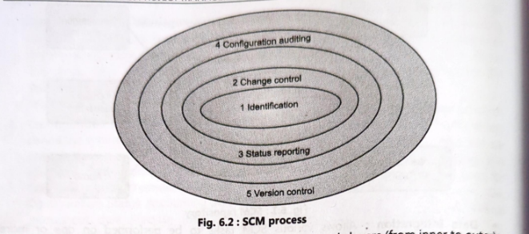
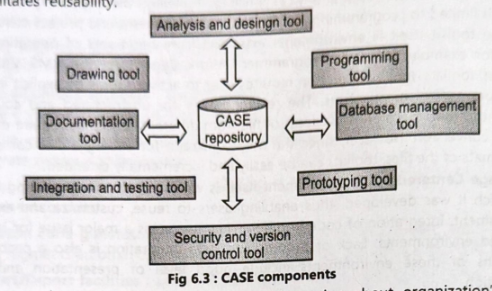
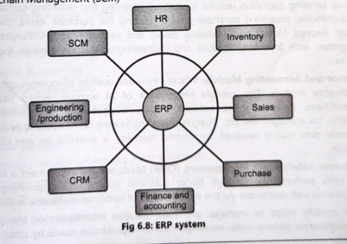

# SCM

# Summary Table: Software Configuration Management (SCM)

| Topic                                    | Summary                                                                                                                                                                                                                               |
| -------------------------------------------- | ----------------------------------------------------------------------------------------------------------------------------------------------------------------------------------------------------------------------------------------- |
| Definition of SCM                        | SCM is a disciplined process for identifying, organizing, controlling, and tracking changes in software artifacts (code, documents, data) to maintain consistency, integrity, and traceability throughout the software lifecycle. |
| Purpose of SCM                           | • Manages continuous changes in software • Preserves software quality and integrity • Ensures controlled updates of configuration items • Supports maintenance, versioning, and change control                                   |
| Configuration Items (CIs)                | • Computer programs (source/executable code) • Documentation (technical/user docs) • Data (internal/external) These are tracked, versioned, and controlled.                                                          |
| 1. CM Planning & Management              | • Preparation of SCM Plan • Defines roles, responsibilities, tools, procedures • Baseline guidelines, naming conventions • Change control and audit policies Purpose: Defines how SCM will be executed.               |
| 2. Configuration Identification (CI)     | • Identifies all items needing control • Establishes baselines • Defines system architecture and versions • Tracks changes across development stages Purpose: Organize and uniquely label all managed items.              |
| 3. Configuration Control                 | • Evaluates change requests • Approves/rejects changes • Ensures correct changes are implemented • Prevents negative impact on other components Purpose: Only authorized, safe changes are made.                          |
| 4. Configuration Status Accounting (CSA) | • Maintains records of CIs, versions, and histories • Reports current configuration status • Tracks deviations from baselines • Maintains full change history Purpose: Know *what* changed, *why*, *when*, and *by whom*. |
| 5. Configuration Verification & Audit    | • Verifies CI meets functional/performance requirements • Ensures document–software consistency • Confirms all approved changes are implemented Purpose: Ensure integrity and correctness of the baseline.                   |

---

### SCM Processes

| SCM Process            | GitHub Feature                                          |
| ---------------------- | ------------------------------------------------------- |
| Identification         | Repositories, commits, branches, tags                   |
| Change Control         | Pull Requests, code reviews, protected branches         |
| Version Control        | Git commits, branches, merges, tags                     |
| Configuration Auditing | Logs, commit history, PR history, issue logs            |
| Status Reporting       | Dashboards, graphs, notifications, issues, CI/CD status |

---

---

### Github

| SCM Process            | GitHub Feature                                          |
| ---------------------- | ------------------------------------------------------- |
| Identification         | Repositories, commits, branches, tags                   |
| Change Control         | Pull Requests, code reviews, protected branches         |
| Version Control        | Git commits, branches, merges, tags                     |
| Configuration Auditing | Logs, commit history, PR history, issue logs            |
| Status Reporting       | Dashboards, graphs, notifications, issues, CI/CD status |

---

# CASE

### What is CASE

| Topic                | Summary                                                                                                                                                                     |
| ------------------------ | ------------------------------------------------------------------------------------------------------------------------------------------------------------------------------- |
| Definition of CASE   | CASE (Computer-Aided Software Engineering) provides automated tools to support software engineering activities, improve productivity, and ensure quality in system development. |
| What is a CASE Tool? | A computer-based product that automates one or more software development activities. Helps design, document, and generate programs using structured techniques.                 |
| Goal of CASE         | To offer a system description language capable of automatically generating all necessary program code.                                                                          |

| Function        | Description                                                                                                                       | Key Insight                                                      |
| ------------------- | ------------------------------------------------------------------------------------------------------------------------------------- | -------------------------------------------------------------------- |
| Analysis        | Automatically checks for incomplete, inconsistent, or incorrect specifications in diagrams, forms, and reports.                       | Improves requirement quality and detects early errors.               |
| Design          | Creates the technical blueprint using graphical models (DFDs, UML, ER diagrams), UI design, system architecture, and database design. | Helps visualize and model the system accurately.                     |
| Code Generation | Generates program code, database definitions, forms, and reports directly from design models.                                         | Reduces manual coding effort and minimizes coding errors.            |
| Documentation   | Produces technical and user documentation in standard formats for all SDLC phases.                                                    | Ensures consistent and updated documentation throughout development. |

---

### Components of CASE

| Component                    | Purpose                                                     |
| -------------------------------- | --------------------------------------------------------------- |
| CASE Repository                  | Central storage; sharing, reuse, documentation; data dictionary |
| Analysis & Design Tools          | Create models, diagrams, architecture                           |
| Documentation Tools              | Generate technical/user documents automatically                 |
| Programming Tools                | Generate code and database scripts                              |
| Database Tools                   | Manage database schema and scripts                              |
| Prototyping Tools                | Build UI prototypes for early feedback                          |
| Integration & Testing Tools      | Automate testing and defect tracking                            |
| Drawing Tools                    | Create diagrams and visual models                               |
| Security & Version Control Tools | Control access; track changes; maintain versions                |

---

---

### Categories of CASE

| Category                       | Supported SDLC Phase                    | Key Features                                                                                       | Examples                                                                                                       |
| ---------------------------------- | ------------------------------------------- | ------------------------------------------------------------------------------------------------------ | ------------------------------------------------------------------------------------------------------------------ |
| Upper CASE Tools               | Analysis & Design (Front-end)               | Modeling tools, Analysis tools, Cross-referencing, Central repository access, Documentation generators | *Rational Rose*, *Lucidchart*, *MS Visio*, *Draw.io*, *ERWin*, *StarUML*                                           |
| Lower CASE Tools               | Coding, Testing & Implementation (Back-end) | Code generators, Testing tools, Screen/Report generators, Documentation tools, Repository access       | *Eclipse*, *NetBeans*, *VS Code*, *JUnit*, *Selenium*, *CodeSmith*, *SQL Developer Data Modeler*                   |
| Integrated CASE Tools (I-CASE) | Entire SDLC (End-to-End)                    | Combines analysis + design + coding + testing + documentation, Full repository integration             | *IBM Rational Suite*, *Enterprise Architect (Sparx)*, *Oracle Designer*, *Visual Studio (with modeling + testing)* |

---

### Advantages and Limitations

| Advantages                                                     | Disadvantages                                      |
| ------------------------------------------------------------------ | ------------------------------------------------------ |
| Helps create systems that work well for a long time.               | Initial development cost is high.                      |
| Makes it easier to build systems that match user needs accurately. | Needs very clear and detailed requirements from users. |
| Produces well-organized and complete documentation automatically.  | Can be hard to customize for specific needs.           |
| Reduces the amount of manual work needed for system support.       | Maintenance staff must be trained to use the tools.    |
| Makes systems more flexible and easier to update.                  | May not fit smoothly with older or existing systems.   |

---

# GSD

| Challenge        | Explanation (In Simple Words)                 |
| -------------------- | ------------------------------------------------- |
| Time zone gaps       | Less overlapping working hours → delays           |
| Communication issues | Chats/emails not always clear → misunderstandings |
| Control breakdown    | Hard to manage multiple sites → slow coordination |
| Cohesion barriers    | Weak team bonding → low trust & cooperation       |
| Cultural differences | Different work styles → confusion & conflict      |

---

# CRM

* CRM helps organizations build and maintain strong relationships with customers by understanding what they need and offering the right services at the right time.
* Operational CRM: Manages day-to-day interactions: call centers, service support, sales databases.
* Collaborative CRM: Supports communication between different departments to serve customers better.
* Analytical CRM: Uses data mining and analytics to understand customer behavior and preferences.

| Phase         | Role of CRM                                                                                                |
| ------------- | ---------------------------------------------------------------------------------------------------------- |
| Planning  | Identifies customer needs, supports requirement analysis, aligns project goals with customer expectations  |
| Execution | Maintains communication, tracks feedback, guides adjustments, prevents misunderstandings                   |
| Delivery  | Ensures promised value, improves satisfaction, enables personalized delivery, strengthens customer loyalty |

---

# ERP

### Role and Importance 

| Area              | Importance of ERP (Summary in Simple Words)                                                                                                               |
| --------------------- | ------------------------------------------------------------------------------------------------------------------------------------------------------------- |
| Resource Planning | Integrates all departments, shows real-time data of materials, money, and manpower, avoids shortages or overstock, and improves overall resource utilization. |
| Scheduling        | Helps plan production schedules, machine usage, and workforce allocation by providing accurate availability information and reducing delays.                  |
| Decision Making   | Provides accurate, real-time reports and dashboards that help managers make quick, informed, data-driven decisions.                                           |

---

### Advantages & Limitations

| Advantages                                       | Limitations                                           |
| ---------------------------------------------------- | --------------------------------------------------------- |
| Provides a single, unified source of real-time data  | High implementation and maintenance cost                  |
| Improves internal communication and coordination     | Requires major changes in existing business processes     |
| Enhances customer service and increases productivity | Requires extensive training and faces employee resistance |

---

---

# Business Process Engineerig / Rengineering

| Step                             | Summary (In Simple Words)                                                     |
| ------------------------------------ | --------------------------------------------------------------------------------- |
| 1. Define Objectives & Framework | Set clear goals for improvement and communicate the need for change to employees. |
| 2. Identify Customer Needs       | Understand who the customers are, what they expect, and what problems they face.  |
| 3. Study the Existing Process    | Analyze the current process, find weaknesses and unnecessary steps.               |
| 4. Formulate a Redesign Plan     | Propose improvements, compare alternatives, and create the best new process.      |
| 5. Implement the Redesign        | Apply the new process, train employees, monitor progress, and ensure acceptance.  |

| Advantages of BPE                                     | Limitations of BPE                                                      |
| --------------------------------------------------------- | --------------------------------------------------------------------------- |
| Improves performance, quality, and customer satisfaction. | Employees may resist change; acceptance is difficult.                       |
| Removes inefficiencies and reduces cost/time.             | Implementation is expensive and time-consuming.                             |
| Makes processes more flexible and competitive.            | Requires deep analysis and strong management support; failure risk is high. |

---

# SAP (System applications and products)

### Summary Table: Working of SAP (SAP R/3 Architecture)

| Layer / Component  | Role in SAP Working (Simple Summary)                                                                                                  |
| ---------------------- | ----------------------------------------------------------------------------------------------------------------------------------------- |
| Presentation Layer | Front-end where users interact with SAP; provides GUI for entering data, running reports, and performing transactions.                    |
| Application Layer  | Processes business logic; handles user requests through dispatcher and work processes; executes calculations, validations, and workflows. |
| Database Layer     | Stores all enterprise data (HR, finance, inventory, sales, production, etc.); ensures centralized, real-time, secure data access.         |
| Overall Working    | All departments enter data → processed by application layer → stored centrally → updated instantly for all modules in real time.          |

---

### Summary Table: Advantages vs Limitations of SAP

| Advantages                                                     | Limitations                                                                  |
| ------------------------------------------------------------------ | -------------------------------------------------------------------------------- |
| Eliminates duplicate data using a single integrated database.      | Very expensive to implement, customize, and maintain.                            |
| Standardizes business processes across the organization.           | Requires heavy training; system is complex for new users.                        |
| Real-time data improves planning, scheduling, and decision-making. | Customization is limited and costly; may require redesign of business processes. |
| Reduces administrative costs through automation.                   | Implementation takes a long time and needs expert consultants.                   |
| Supports global operations (multi-language, multi-currency).       | Employees may resist change due to complexity.                                   |
